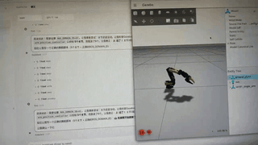
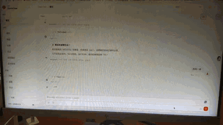

# IB-Robot

> IB-Robot (Intelligence Boom Robot): An integrated embodied AI framework merging the Hugging Face LeRobot ecosystem with ROS 2.

## 🌟 New: OpenClaw Social Control Support!

We are excited to announce that IB-Robot now fully supports remote social control via the **[OpenClaw](https://github.com/openclaw/openclaw)** AI Agent! Whether in **Gazebo simulation** or on a **real SO-101 robot arm**, you can interact with the robot using natural language through Feishu, QQ, Discord, and more.

|                            Simulation Demo                            |                             Real Robot Demo                            |
| :---------------------------------------------------------------------: | :----------------------------------------------------------------------: |
|  |  |

---

## Project Positioning

IB-Robot is an **integrated robot development framework** designed to bridge the gap between the Hugging Face LeRobot machine learning ecosystem and the ROS 2 robotics middleware. It provides a complete toolchain from data collection and training to real-world deployment.

### Core Integration Capabilities

| Dimension | LeRobot Ecosystem | ROS 2 Ecosystem | IB-Robot Solution |
|-----------|-------------------|-----------------|-------------------|
| **Data Flow** | Episode-based | Topic-based | Contract-driven bidirectional real-time conversion. |
| **Temporal** | Discrete Steps | Continuous RT Stream | Automated alignment and high-frequency interpolation. |
| **Control** | End-to-end Policies | Hierarchical Planning | **Dual-mode control (ACT vs. MoveIt).** |
| **Deployment** | Python Scripts | ROS 2 Nodes | Distributed edge-cloud collaborative deployment. |

## System Architecture


### Architecture Deep Dive

IB-Robot builds an end-to-end closed-loop system from perception and decision-making to execution, realizing seamless integration between ML and robotics:

1. **Multimodal Perception & Collection**:
   - **Low-level Perception**: Unified access to multiple cameras (USB/RealSense), LiDAR, and microphones via ROS 2 Drivers.
   - **Diverse Collection**: Supports **VR controllers, Xbox controllers, and mobile IMU** teleoperation for expert demonstration data.

2. **Protocol Conversion Hub (tensormsg)**:
   - Serving as the hub, tensormsg handles the bidirectional conversion between `ros_msg` and `tensor`, ensuring data type safety and consistency via the Contract mechanism.

3. **Inference & R&D Service**:
   - Supports various VLA (Vision-Language-Action) models (e.g., SmolVLA, Pi0.5) and end-to-end policy models (e.g., ACT, Diffusion Policy). The system **auto-detects backends** and launches them on demand based on the control mode.

4. **Unified Action Dispatcher**:
   - Acts as the robot's "cerebellum". In ACT mode, it handles **Action Chunking** scheduling and high-frequency interpolation; in planning mode, it interfaces with **MoveIt 2** for constrained trajectory execution, providing unified `RobotStatus` reporting.

5. **Configuration-Driven Center (robot_config)**:
   - Realizes "Spec-driven robot behavior". Defines joints, controller modes, and sensor parameters via a single YAML, supporting one-click switching between simulation and real-world environments.

---

## Repository Structure

```text
IB_Robot/                           # Main Workspace
├── .gitmodules                     # Git submodule configuration
├── README.md                       # Main documentation (Chinese)
├── README.en.md                    # Main documentation (English)
├── LICENSE                         # Apache 2.0 License
├── config.json                     # AI Agent configuration (AtomGit API tokens, etc.)
│
├── .agents/                        # AI Agent configuration directory
│   └── skills/                     # AI Agent skills (see .agents/skills/README.md)
│
├── libs/                           # External dependencies
│   ├── lerobot/                    # [Submodule] LeRobot training framework
│   └── atomgit_sdk/                # AtomGit API SDK
│
├── src/                            # Core source packages
│   ├── robot_config/               # System master control, specs, and launch entry
│   ├── action_dispatch/            # Unified action dispatcher (Dual-mode)
│   ├── tensormsg/                  # LeRobot ↔ ROS 2 protocol conversion hub
│   ├── ibrobot_msgs/               # Unified system interfaces (Message/Action)
│   ├── dataset_tools/              # Dataset collection & conversion (Episode Recorder)
│   ├── robot_teleop/               # Teleoperation (Leader Arm/Xbox controller)
│   ├── robot_description/          # Unified URDF/SRDF/MJCF model descriptions
│   ├── robot_moveit/               # MoveIt 2 motion planning integration
│   ├── inference_service/          # Multi-model inference & deployment service
│   ├── so101_hardware/             # SO-101 motor driver interface
│   ├── pymoveit2/                  # [Submodule] MoveIt2 Python interface
│   ├── rosclaw/                    # [Submodule] OpenClaw social control integration
│   ├── sim_models/                 # Simulation scene models (Gazebo/MuJoCo)
│   ├── model_utils/                # Model utility library
│   ├── usb_cam/                    # USB camera driver
│   ├── voice_asr_service/          # Voice recognition service
│   └── workflows/                  # CI/CD configuration
│
├── docs/                           # Detailed architecture docs and dev guides
│   ├── pictures/                   # Architecture diagrams and demo GIFs
│   └── videos/                     # Demo videos (source files)
├── scripts/                        # Setup and verification scripts
└── build/                          # Build output (Auto-generated)
```

---

## Environment Initialization (First-time Setup)

**Important: This step only needs to be run once after the initial clone.**

### 0. System Requirements

- **OS**: openEuler Embedded 24.03
- **ROS Version**: ROS 2 Humble
- **Python**: System native Python 3.11. **Do NOT run in an active Conda environment to avoid library version conflicts (e.g., libstdc++).**

### 1. One-click Initialization

Run `./scripts/setup.sh`. This script automates heavy operations:

1. **Submodule Sync**: Runs `git submodule update --init --recursive` to download core source code.
2. **System Dependencies**: Installs C++ build tools, `nlohmann-json`, and other hardware driver dependencies via the system package manager.
3. **Virtual Environment (venv)**: Creates a `venv` directory in the root to isolate ML dependencies (like PyTorch) from the system ROS 2 environment.
4. **ML Stack Installation**: Automatically installs `torch`, `lerobot`, and specific `numpy (< 2.0)` versions compatible with ROS 2 Humble.
5. **Environment Script**: Generates or updates `.shrc_local` for one-click environment loading.

### 2. Developer Fork Setup (Optional)

The script will ask if you want to set up personal forks. If you are a core developer, enter your AtomGit username to automatically link `origin` (your fork) and `upstream` (main repo).

---

## Development Workflow

### 1. Load Environment

Every time you open a new terminal, you must load the project environment variables:

```bash
source .shrc_local
```

### 2. Assign Domain ID

To avoid conflicts with other ROS 2 users on the same network, assign a unique Domain ID:

```bash
export ROS_DOMAIN_ID=<Unique ID between 0-232>
```

### 3. Build Project

Run the unified build script after any code changes:

```bash
./scripts/build.sh
```

*Note: This script handles editable installation of lerobot and cleans up build pollution.*

---

## AI Agent Skills

IB-Robot includes built-in AI programming agent skills to help Claude Code, Gemini CLI, OpenCode, and other AI Agents better understand the project architecture and development workflow. For available skills, see [.agents/skills/README.md](.agents/skills/README.md).

### config.json Configuration

`config.json` stores configuration for AI Agents, currently used for AtomGit API integration:

```json
{
  "atomgit": {
    "token": "$ATOMGIT_TOKEN",
    "owner": "openEuler",
    "repo": "IB_Robot",
    "baseUrl": "https://api.atomgit.com"
  }
}
```

**Getting an AtomGit Personal Access Token**:

1. Visit <https://atomgit.com> and log in
2. Click your avatar (top-right) → Settings
3. Find "Access Tokens"
4. Click "New Token", grant `repo` and `pull_request` permissions
5. **Copy and save** the token immediately (shown only once)

Set the environment variable by adding the following to your `~/.zshrc` or `~/.bashrc`:

```bash
export ATOMGIT_TOKEN="your_token_here"
```

### Supported Agents

All clients compatible with the Agent Skills standard will automatically scan `.agents/skills/`. See [agentskills.io](https://agentskills.io).

---

## Running Guide

All operations are triggered via the unified entry point in the `robot_config` package.

### Basic Simulation (Auto-start model inference control)

```bash
ros2 launch robot_config robot.launch.py robot_config:=so101_single_arm use_sim:=true
```

### Basic Simulation (No inference, controllers only)

```bash
ros2 launch robot_config robot.launch.py robot_config:=so101_single_arm use_sim:=true with_inference:=false
```

### MoveIt Planning Mode (Auto-detect, with RViz)

```bash
ros2 launch robot_config robot.launch.py robot_config:=so101_single_arm control_mode:=moveit_planning use_sim:=true
```

### MoveIt Headless Mode (No RViz)

```bash
ros2 launch robot_config robot.launch.py robot_config:=so101_single_arm control_mode:=moveit_planning use_sim:=true moveit_display:=false
```

### Real Hardware Execution

```bash
ros2 launch robot_config robot.launch.py robot_config:=so101_single_arm use_sim:=false
```

### Manual Override (Advanced Debugging)

```bash
ros2 launch robot_config robot.launch.py control_mode:=model_inference with_inference:=true use_sim:=true
```

---

## Parameter Description

| Parameter | Description | Default |
|-----------|-------------|---------|
| `robot_config` | Robot config name (matches YAML in `config/robots/`) | `so101_single_arm` |
| `config_path` | Absolute path to config file (overrides `robot_config`) | Empty |
| `use_sim` | Use Gazebo simulation mode | `false` |
| `control_mode` | Override default mode (`model_inference` / `moveit_planning` / `teleop`) | From YAML |
| `with_inference`| Force enable/disable inference service | Auto-detect |
| `with_moveit`   | Force enable/disable MoveIt core | Auto-detect |
| `moveit_display`| Launch MoveIt RViz interface | `true` |
| `auto_start_controllers` | Automatically activate controllers on start | `true` |

---

## Troubleshooting

### 1. Residual Controllers

If controllers fail to start or ports are busy, run the cleanup script:

```bash
./scripts/cleanup_ros.sh
```

### 2. Shared Memory (SHM) Errors

If you see `RTPS_TRANSPORT_SHM Error`, try cleaning the cache:

```bash
sudo rm -rf /dev/shm/fastrtps_*
export ROS_LOCALHOST_ONLY=1
```

---

## 🦾 OpenClaw Social Control & Remote AI Agent

IB-Robot deeply integrates the [OpenClaw](https://github.com/openclaw/openclaw) AI Agent framework with the [RosClaw](https://github.com/PlaiPin/rosclaw) bridge, enabling remote robot control via natural language through Feishu, QQ, Discord, or Slack.

> **Acknowledgements**: Thanks to the OpenClaw team for the powerful AI agent framework, and RosClaw for the ROS 2 bridge solution.

### 1. Robot-Side Configuration (RosClaw & Bridge)

The robot side requires a WebSocket bridge driver and a discovery service.

- **Pull submodules**:
  Ensure the latest RosClaw submodule source is pulled:
  ```bash
  git submodule update --init --recursive
  ```
- **Install system dependencies**:
  ```bash
  # rosbridge_suite is required for WebSocket communication
  sudo apt-get update && sudo apt-get install -y ros-humble-rosbridge-suite
  ```
- **Start the robot**:
  First launch the robot (simulation or real hardware):
  ```bash
  # use_sim:=true for simulation, false for real hardware
  ros2 launch robot_config robot.launch.py robot_config:=so101_single_arm control_mode:=model_inference use_sim:=true with_inference:=false
  ```
- **Start the social bridge**:
  This project includes RosClaw as a submodule at `src/rosclaw`. Run the one-click script:
  ```bash
  # Auto-compiles the submodule and starts rosbridge_websocket, rosapi, and discovery nodes
  ./scripts/start_rosclaw.sh
  ```
  After launch, WebSocket service will be available on port `9090`.

### 2. Control-Side Configuration (OpenClaw)

OpenClaw serves as the robot's "brain" and "frontend", connecting to social apps and invoking LLMs to understand commands.

- **Install OpenClaw**:
  Use the official quick-install script (requires Node.js 22+):
  ```bash
  # Install OpenClaw CLI
  npm install -g openclaw

  # Run the onboarding wizard to configure your LLM (e.g., GLM-4/5 or GPT-4)
  openclaw onboard
  ```
- **Install RosClaw plugin**:
  ```bash
  # Run from the IB_Robot root directory
  openclaw plugins install ./src/rosclaw/extensions/openclaw-plugin
  ```
- **Configure robot connection**:
  ```bash
  # Set the robot WebSocket address (replace with actual IP)
  openclaw config set plugins.entries.rosclaw.config.rosbridge.url "ws://<ROBOT_IP>:9090"
  ```
- **Inject IB-Robot specific skills**:
  To help the AI accurately understand units (radians) and vision topics, deploy the skill specification:
  ```bash
  mkdir -p ~/.openclaw/workspace/skills/ibrobot-control
  cp ./docs/ib_robot_social_skill.md ~/.openclaw/workspace/skills/ibrobot-control/SKILL.md
  ```
- **Start Gateway**:
  ```bash
  openclaw gateway
  ```

### 3. Interaction Examples

Once connected, you can interact via the web UI (`http://localhost:18789`) or through bound Feishu, QQ, or Discord:

- *"Show me the robot's current capabilities"* — Retrieve all sensor topics.
- *"Move the robot arm to the home position"* — AI automatically converts angles to **radians** based on the skill document.
- *"What's on the table?"* — AI captures and analyzes an image from `/camera/top/image_raw`.
- *"Pick up the bottle on the table"* — AI triggers IB-Robot's `DispatchInfer` action.

---

**Maintainer**: IB-Robot Team  
**Project Home**: <https://atomgit.com/openEuler/IB_Robot>  
**Feedback**: <https://atomgit.com/openEuler/IB_Robot/issues>
