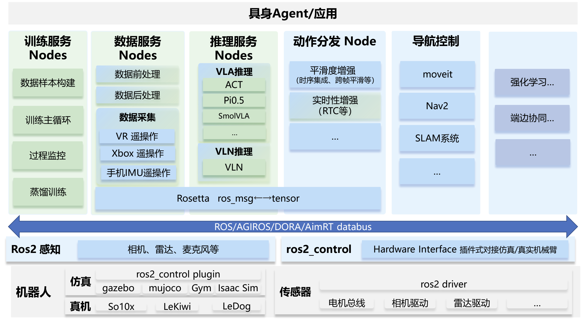

# IB-Robot

> IB-Robot (Intelligence Boom Robot): An integrated embodied AI framework merging the Hugging Face LeRobot ecosystem with ROS 2.

## Project Positioning

IB-Robot is an **integrated robot development framework** designed to bridge the gap between the Hugging Face LeRobot machine learning ecosystem and the ROS 2 robotics middleware. It provides a complete toolchain from data collection and training to real-world deployment.

### Core Integration Capabilities

| Dimension | LeRobot Ecosystem | ROS 2 Ecosystem | IB-Robot Solution |
|-----------|-------------------|-----------------|-------------------|
| **Data Flow** | Episode-based | Topic-based | Contract-driven bidirectional real-time conversion. |
| **Temporal** | Discrete Steps | Continuous RT Stream | Automated alignment and high-frequency interpolation. |
| **Control** | End-to-end Policies | Hierarchical Planning | **Dual-mode control (ACT vs. MoveIt).** |
| **Deployment** | Python Scripts | ROS 2 Nodes | Distributed edge-cloud collaborative deployment. |

## System Architecture



### Architecture Deep Dive

IB-Robot builds an end-to-end closed-loop system from perception and decision-making to execution, realizing seamless integration between ML and robotics:

1. **Multimodal Perception & Collection**:
   - **Low-level Perception**: Unified access to multiple cameras (USB/RealSense), LiDAR, and microphones via ROS 2 Drivers.
   - **Diverse Collection**: Supports **VR controllers, Xbox controllers, and mobile IMU** teleoperation for expert demonstration data.

2. **Protocol Conversion Hub (tensormsg)**:
   - Serving as the hub, tensormsg handles the bidirectional conversion between `ros_msg` and `tensor`, ensuring data type safety and consistency via the Contract mechanism.

3. **Inference & R&D Service**:
   - Supports various VLA (Vision-Language-Action) models (e.g., SmolVLA, Pi0.5) and end-to-end policy models (e.g., ACT, Diffusion Policy). The system **auto-detects backends** and launches them on demand based on the control mode.

4. **Unified Action Dispatcher**:
   - Acts as the robot's "cerebellum". In ACT mode, it handles **Action Chunking** scheduling and high-frequency interpolation; in planning mode, it interfaces with **MoveIt 2** for constrained trajectory execution, providing unified `RobotStatus` reporting.

5. **Configuration-Driven Center (robot_config)**:
   - Realizes "Spec-driven robot behavior". Defines joints, controller modes, and sensor parameters via a single YAML, supporting one-click switching between simulation and real-world environments.

---

## Repository Structure

```text
IB_Robot/                           # Main Workspace
├── .gitmodules                     # Git submodule configuration
├── README.md                       # Main documentation (Chinese)
├── README.en.md                    # Main documentation (English)
├── LICENSE                         # Apache 2.0 License
│
├── libs/                           # External Dependencies
│   └── lerobot/                    # [Submodule] LeRobot training framework
│
├── src/                            # [Submodule] Core source packages
│   ├── robot_config/               # System master control and specs
│   ├── action_dispatch/            # Unified action dispatcher (Dual-mode)
│   ├── rosetta/                    # LeRobot ↔ ROS 2 Hub (To be renamed to tensormsg)
│   ├── robot_description/          # Unified URDF/SRDF descriptions
│   ├── robot_moveit/               # MoveIt 2 motion planning integration
│   ├── inference_service/          # Multi-model inference service
│   ├── so101_hardware/             # SO-101 motor driver interface
│   ├── robot_interface/            # [Deprecated] Replaced by robot_config
│   ├── rosetta_interfaces/         # [Agreed] Unified system interfaces
│   └── workflows/                  # CI/CD configuration
│
├── docs/                           # Detailed architecture and dev guides
├── scripts/                        # Setup and verification scripts
└── build/                          # Build output (Auto-generated)
```

---

## Environment Initialization (First-time Setup)

**Important: This step only needs to be run once after the initial clone.**

### 0. System Requirements
- **OS**: openEuler Embedded 24.03
- **ROS Version**: ROS 2 Humble
- **Python**: System native Python 3.11. **Do NOT run in an active Conda environment to avoid library version conflicts (e.g., libstdc++).**

### 1. One-click Initialization
Run `./scripts/setup.sh`. This script automates heavy operations:

1.  **Submodule Sync**: Runs `git submodule update --init --recursive` to download core source code.
2.  **System Dependencies**: Installs C++ build tools, `nlohmann-json`, and other hardware driver dependencies via the system package manager.
3.  **Virtual Environment (venv)**: Creates a `venv` directory in the root to isolate ML dependencies (like PyTorch) from the system ROS 2 environment.
4.  **ML Stack Installation**: Automatically installs `torch`, `lerobot`, and specific `numpy (< 2.0)` versions compatible with ROS 2 Humble.
5.  **Environment Script**: Generates or updates `.shrc_local` for one-click environment loading.

### 2. Developer Fork Setup (Optional)
The script will ask if you want to set up personal forks. If you are a core developer, enter your GitCode username to automatically link `origin` (your fork) and `upstream` (main repo).

---

## Development Workflow

### 1. Load Environment
Every time you open a new terminal, you must load the project environment variables:
```bash
source .shrc_local
```

### 2. Assign Domain ID
To avoid conflicts with other ROS 2 users on the same network, assign a unique Domain ID:
```bash
export ROS_DOMAIN_ID=<Unique ID between 0-232>
```

### 3. Build Project
Run the unified build script after any code changes:
```bash
./scripts/build.sh
```
*Note: This script handles editable installation of lerobot and cleans up build pollution.*

---

## Running Guide

All operations are triggered via the unified entry point in the `robot_config` package.

### Basic Simulation (Auto-start model inference control)
```bash
ros2 launch robot_config robot.launch.py robot_config:=so101_single_arm use_sim:=true
```

### Basic Simulation (No inference, controllers only)
```bash
ros2 launch robot_config robot.launch.py robot_config:=so101_single_arm use_sim:=true with_inference:=false
```

### MoveIt Planning Mode (Auto-detect, with RViz)
```bash
ros2 launch robot_config robot.launch.py robot_config:=so101_single_arm control_mode:=moveit_planning use_sim:=true
```

### MoveIt Headless Mode (No RViz)
```bash
ros2 launch robot_config robot.launch.py robot_config:=so101_single_arm control_mode:=moveit_planning use_sim:=true moveit_display:=false
```

### Real Hardware Execution
```bash
ros2 launch robot_config robot.launch.py robot_config:=so101_single_arm use_sim:=false
```

### Manual Override (Advanced Debugging)
```bash
ros2 launch robot_config robot.launch.py control_mode:=teleop_act with_inference:=true use_sim:=true
```

---

## Parameter Description

| Parameter | Description | Default |
|-----------|-------------|---------|
| `robot_config` | Robot config name (matches YAML in `config/robots/`) | `so101_single_arm` |
| `config_path` | Absolute path to config file (overrides `robot_config`) | Empty |
| `use_sim` | Use Gazebo simulation mode | `false` |
| `control_mode` | Override default mode (`teleop_act` / `moveit_planning`) | From YAML |
| `with_inference`| Force enable/disable inference service | Auto-detect |
| `with_moveit`   | Force enable/disable MoveIt core | Auto-detect |
| `moveit_display`| Launch MoveIt RViz interface | `true` |
| `auto_start_controllers` | Automatically activate controllers on start | `true` |

---

## Troubleshooting

### 1. Residual Controllers
If controllers fail to start or ports are busy, run the cleanup script:
```bash
./scripts/cleanup_ros.sh
```

### 2. Shared Memory (SHM) Errors
If you see `RTPS_TRANSPORT_SHM Error`, try cleaning the cache:
```bash
sudo rm -rf /dev/shm/fastrtps_*
export ROS_LOCALHOST_ONLY=1
```

---

**Maintainer**: IB-Robot Team  
**Project Home**: https://gitcode.com/BreezeWu/IB_Robot  
**Feedback**: https://gitcode.com/BreezeWu/IB_Robot/issues
