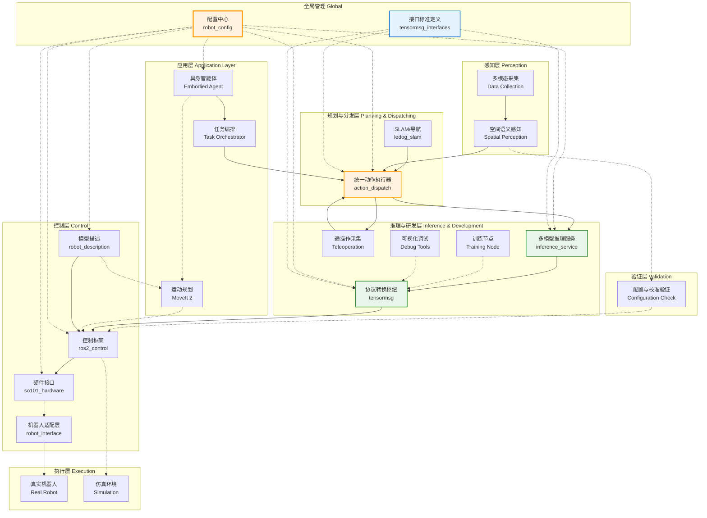

# IB-Robot 架构文档

> IB-Robot (Intelligence Boom Robot): 融合 LeRobot 机器学习生态与 ROS 2 的具身智能机器人开发框架

## 目录

- [什么是 IB-Robot？](#什么是-ib-robot)
- [本架构解决了什么问题？](#本架构解决了什么问题)
- [架构全景](#架构全景)
- [核心概念解释](#核心概念解释)
- [分层设计详解](#分层设计详解)
- [数据流与交互](#数据流与交互)
- [包清单与职责](#包清单与职责)
- [路线图](#路线图)

---

## 什么是 IB-Robot？


**LeRobot** 是 Hugging Face 开源的机器人学习框架，专注于用机器学习让机器人学会执行任务（比如抓东西、叠衣服）。

**ROS 2**（Robot Operating System 2）是机器人领域最常用的中间件，提供通信、硬件抽象、工具链等基础设施。

**IB-Robot (Intelligence Boom Robot)** 是两者的**枢纽与桥梁**：
- 把 LeRobot 训练好的 AI 策略模型无缝部署到真实机器人或仿真环境中。
- 利用 ROS 2 强大的感知、导航和控制能力，为具身智能决策提供支撑。
- 提供从数据采集、策略训练到分布式部署的端到端完整工作流。

```
┌─────────────────┐         ┌──────────────────┐
│  LeRobot (AI)   │ ◄─────► │   ROS 2 (Infra)  │
│  - 训练策略      │         │  - 硬件控制       │
│  - 推理引擎      │         │  - 通信总线       │
│  - 数据规范      │         │  - 感知/导航      │
└─────────────────┘         └──────────────────┘
         │                            │
         └──────────┬─────────────────┘
                    ▼
         ┌──────────────────┐
         │     IB-Robot     │  ◄── 本项目
         │  (Intelligence)  │
         └──────────────────┘
```

---

## 本架构解决了什么问题？

### 问题 1：机器学习与机器人控制的"世界观"差异

| 维度 | LeRobot (ML 世界) | ROS 2 (控制世界) |
|------|------------------|-----------------|
| **数据单位** | Episode（回合）| Topic（话题）|
| **时间观念** | 离散时间步 (Steps) | 连续时间流 (Real-time) |
| **硬件抽象** | 直接电机控制 | 通过 ros2_control |
| **部署形态** | Python 脚本/Tensor | 分布式节点/ROS Msg |

**解决**：通过核心组件 `tensormsg` 实现契约驱动的协议转换，让两者"共用一种语言"。

### 问题 2：从科研实验室到工业级部署的鸿沟

传统的机器人学习部署往往缺乏工程化支撑：
- 传感器数据缺乏统一标准
- 多个 AI 模型（如 VLA 决策 + GraspNet 抓取）难以高效协同
- 缺乏自动化的数据记录与回流机制

**解决**：提供分层架构设计，各层职责解耦，支持模块化扩展。

### 问题 3：具身智能的数据闭环

要实现机器人能力的持续进化，需要解决：
1. 专家示范数据的高效采集
2. 原始数据向训练格式的快速转化
3. 部署后的在线评估与数据回流

**解决**：建立统一的数据管道（MCAP/rosbag2 ↔ LeRobot Dataset）。

---

## 架构全景

### 整体架构图



### 架构设计原则

1. **分层解耦**：每一层只与相邻层通过标准接口通信，屏蔽底层复杂性。
2. **配置驱动 (Spec-Driven)**：所有本体规格、控制模式、关节定义均由 `robot_config` 统筹，实现"一处定义，全局生效"。
3. **仿真/实机对齐**：通过抽象硬件接口，确保同一套 AI 逻辑在仿真与实机间无缝平移。
4. **数据生命周期管理**：原生支持从采集、训练到部署的全生命周期数据闭环。

---

## 核心概念解释

### 1. 具身智能（Embodied AI）

传统 AI 侧重于数字世界的交互，IB-Robot 关注的具身 AI 则强调物理实体的反馈闭环：
- **感知 (Sensation)**：多模态数据输入（视觉、力觉、关节状态）。
- **决策 (Cognition)**：AI 模型（Policy/VLA）生成动作指令。
- **执行 (Action)**：驱动物理电机并根据反馈调整。

### 2. 策略（Policy）

在 IB-Robot 中，**策略**是连接观察与动作的核心函数：
`Action = Policy(Observation, Prompt)`
LeRobot 生态提供了丰富的 Policy 实现（如 ACT, Diffusion, VLA 等），IB-Robot 负责将其具身化。

### 3. 数据契约与 tensormsg

为了打破 ML 与控制系统的壁垒，我们引入了 `tensormsg`：
- **转换**：将 ROS 2 连续话题流转化为机器学习所需的张量快照。
- **契约**：通过合约文件（Contract）严格定义输入输出映射，确保模型部署的类型安全。

### 4. ros2_control 与双模架构

IB-Robot 深度集成 ROS 2 Control，并在此基础上实现了：
- **ACT 模式**：高频流式位置控制，适合端到端模仿学习。
- **MoveIt 模式**：轨迹规划控制，适合基于几何或视觉语言的目标导向任务。

---

## 分层设计详解

### 第 1 层：应用层（Application Layer）

**职责**：理解复杂意图，执行高层逻辑。

| 组件 | 状态 | 功能描述 |
|------|------|----------|
| **具身智能体 (Embodied Agent)** | 规划中 | 集成 ASR/VLM，将自然语言转化为机器人可理解的任务序列。 |
| **任务编排 (Task Orchestrator)** | 规划中 | 使用行为树 (BT) 或逻辑状态机管理子任务流程。 |
| **MoveIt 2** | 已集成 | 负责路径规划、碰撞检测及逆运动学求解。 |

---

### 第 2 层：规划与分发层（Planning & Dispatching）

**职责**：充当机器人的"小脑"，进行动作仲裁与状态反馈。

| 组件 | 状态 | 功能描述 |
|------|------|----------|
| **action_dispatch** | 已实现 | **统一动作执行器**。支持双模切换（Topic/Action），负责指令平滑、保护及状态上报。 |
| **ledog_slam** | 已实现 | 提供基础的 SLAM 定位与 Nav2 导航能力。 |

---

### 第 3 层：推理与研发层（Inference & Development）

**职责**：运行 AI 模型，支持研发工作流。

| 组件 | 状态 | 功能描述 |
|------|------|----------|
| **tensormsg** | 已实现 | **转换枢纽**。连接 ROS 2 环境与 LeRobot 模型，负责数据双向转换。 |
| **inference_service** | 已实现 | 多模型推理框架，支持 VLA/SmolVLA/YOLO 等模型的容器化部署。 |
| **tensormsg_interfaces** | 已废弃 | **[Legacy]** 系统统一接口定义 (由各模块内部定义替代)。 |

---

### 第 6 层：控制层（Control）

**职责**：屏蔽硬件差异，提供稳健的底层控制。

| 组件 | 状态 | 功能描述 |
|------|------|----------|
| **robot_config** | 已实现 | **配置中心**。管理全系统的规格文件（YAML），作为唯一真相来源。 |
| **robot_description** | 已实现 | 统一管理机器人 URDF/SRDF 及相关 Mesh 资产。 |
| **so101_hardware** | 已实现 | SO-101 舵机臂的实机驱动实现。 |
| **robot_interface** | 已废弃 | **[Legacy]** 机器人适配抽象层 (功能已迁移至 robot_config)。 |

---

## 路线图 (Roadmap)

### Phase 1: 核心引擎架构 ✅
- [x] 基于 `tensormsg` 的协议转换枢纽
- [x] 配置驱动的 `robot_config` 体系
- [x] 统一动作执行器 `action_dispatch` (双模支持)
- [x] SO-101 仿真与实机驱动对齐

### Phase 2: 感知增强与验证 🔧
- [x] 基础视觉传感器接入 (USB/RealSense)
- [ ] 自动化配置一致性验证脚本 (validate_config)
- [ ] 传感器外参在线标定工具

### Phase 3: 高级智能与采集 🚧
- [ ] 跨包数据闭环：从演示采集到自动导出数据集
- [ ] 交互式调试工具：Attention 热力图可视化
- [ ] 多源遥操作接口 (VR / Leader-Follower)

---

## 快速开始

### 1. 初始化环境
```bash
./scripts/setup.sh
./scripts/build.sh
```

### 2. 启动机器人系统 (以仿真为例)
```bash
ros2 launch robot_config robot.launch.py \
    robot_config:=so101_single_arm \
    use_sim:=true
```

### 3. 运行 AI 推理策略
```bash
ros2 run tensormsg policy_runner --ros-args -p policy_path:=/path/to/model.pt
```

---

**最后更新**：2026-02-14
**维护者**：IB-Robot (Intelligence Boom Robot) 核心团队
**项目地址**：https://gitcode.com/BreezeWu/IB_Robot
