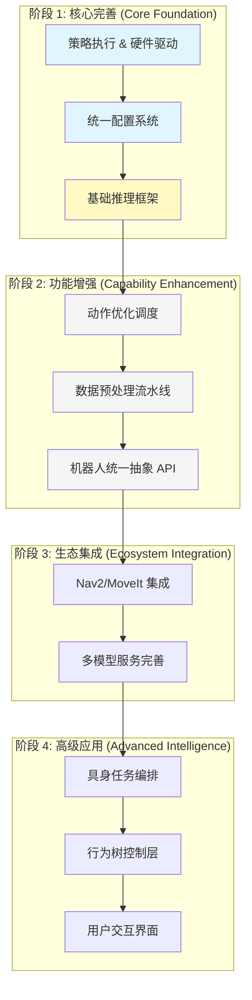

# ROS2 架构发展路线图

> LeRobot ROS2 集成层发展计划

## 目录

- [概述](#概述)
- [阶段 1：核心完善](#阶段-1核心完善当前阶段)
- [阶段 2：功能增强](#阶段-2功能增强)
- [阶段 3：生态集成](#阶段-3生态集成)
- [阶段 4：高级应用](#阶段-4高级应用)
- [技术债务](#技术债务)
- [优先级矩阵](#优先级矩阵)

---

## 概述

本路线图定义了 ROS2 集成层的 4 个发展阶段，从核心功能完善到高级应用实现。

### 发展原则

> **"分层实现，逐步完善"** - 优先完善底层基础设施，再构建上层高级功能

### 里程碑路线

---

## 阶段 1：核心完善（当前阶段）

**优先级**：⭐⭐⭐⭐⭐
**状态**：🔄 进行中

### 目标

建立稳固的核心基础设施，支持基本的策略执行和硬件控制。

### 已完成功能

| 功能 | 包 | 状态 |
|------|-----|------|
| 策略执行桥接 | rosetta | ✅ |
| SO-101 硬件驱动 | so101_hardware | ✅ |
| 统一配置系统 | robot_config | ✅ |
| 机器人描述 | lerobot_description | ✅ |
| SLAM 定位建图 | ledog_slam | ✅ |

### 进行中功能

| 功能 | 包 | 状态 |
|------|-----|------|
| 多模型推理服务 | inference_service | 🔄 |
| 数据预处理节点 | - | 🔄 |

### 待完成核心任务

| 功能 | 描述 | 优先级 | 预计工作量 |
|------|------|--------|-----------|
| 机器人抽象 API | 在 robot_config 中实现统一 API，取代 robot_interface | ⭐⭐⭐⭐⭐ | 3-4 周 |
| 动作优化调度 | 时序集成、平滑处理、安全监控 | ⭐⭐⭐⭐ | 4-6 周 |
| 数据转换流水线 | Rosbag2 → LeRobot 格式转换工具 | ⭐⭐⭐⭐ | 3-5 周 |

---

## 阶段 2：功能增强

**优先级**：⭐⭐⭐⭐
**状态**：❌ 未开始

### 目标

增强推理性能和数据处理能力，提高系统生产环境的可用性。

### 关键任务

#### 1. 动作优化调度（推理层）
- **时序集成**：实现预测动作的平滑过滤与加权。
- **RTC (Real-Time Chunking)**：优化推理与执行的重叠，减少运动卡顿。
- **安全约束**：实时监控关节限位与碰撞。

#### 2. 数据处理流水线（感知层）
- **图像预处理**：实现高性能的裁剪、缩放与归一化。
- **多模态同步**：确保不同频率传感器数据的高精度对齐。
- **批处理转换**：优化大规模演示数据转换效率。

#### 3. 机器人统一抽象 API
- **屏蔽硬件细节**：无论底层是仿真插件还是物理串口，向上层提供一致的 Python 调用接口。
- **Skill 映射**：支持在应用层根据任务名称动态调用底层模型。

---

## 阶段 3：生态集成

**优先级**：⭐⭐⭐
**状态**：❌ 未开始

### 目标

集成标准 ROS2 导航与规划组件，支持复杂空间任务。

### 关键任务

#### 1. Nav2 & MoveIt 集成
- 实现机械臂避障规划与移动底座自主导航。
- 定义“导航-操作”的切换模式。

#### 2. 多模型服务完善
- 集成 VLA (Vision-Language-Action) 模型。
- 支持视觉引导抓取 (YOLO-Graspnet)。

---

## 阶段 4：高级应用

**优先级**：⭐⭐
**状态**：❌ 未开始

### 目标

构建具身智能应用层，支持复杂逻辑与自然语言交互。

### 关键任务

#### 1. 具身任务编排
- 实现从自然语言指令到子任务序列的自动分解。
- 集成任务执行监控与错误自愈。

#### 2. 行为树逻辑控制
- 使用行为树组织复杂的技能序列（如：寻物 -> 移动 -> 抓取 -> 递交）。

#### 3. 开发者与用户界面
- 提供基于 Web 的可视化监控与手动接管界面。

---

## 技术债务

| 问题 | 影响 | 优先级 | 计划修复 |
|------|------|--------|---------|
| `robot_interface` 重构 | 架构耦合 | ⭐⭐⭐⭐⭐ | 阶段 2 |
| 测试覆盖率不足 | 稳定性 | ⭐⭐⭐⭐ | 阶段 2 |
| 话题命名规范化 | 维护成本 | ⭐⭐⭐ | 阶段 3 |
| 跨平台仿真兼容性 | 开发效率 | ⭐⭐⭐⭐ | 阶段 2 |

---

## 优先级矩阵

### 重要性 vs 紧急性

1. **核心 API 与 推理优化**：高重要 / 高紧急 (立即执行)。
2. **数据预处理与仿真增强**：高重要 / 中紧急。
3. **生态集成与高级应用**：中重要 / 长期演进。

---

## 参考文档

- [系统架构](./architecture.md)
- [集成指南](./integration_guide.md)

---

**最后更新**：2026-02-09
**维护者**：LeRobot-ROS2 团队