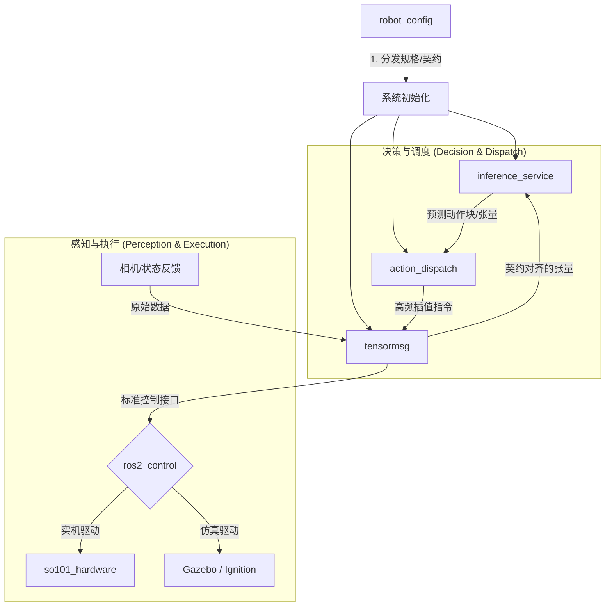

# IB-Robot 核心源码库 (Source Code)

> 本目录包含了 IB-Robot 框架的所有核心 ROS 2 功能包。通过**契约驱动 (Contract-driven)** 的架构设计，实现了高层 AI 推理与底层机器人控制的深度解耦与无缝集成。

---

## 核心设计理念：配置驱动中心 (Configuration-as-Data)

IB-Robot 采用了 **`robot_config`** 作为全系统的“唯一真理源 (Single Source of Truth)”。

在这种架构下，开发者的关注点从繁琐的节点连接转移到了高层的规格定义：
- **本体定义**: 所有的关节限位、控制器映射、传感器外参均在 YAML 中声明。
- **自动合成**: `robot_config` 会根据 YAML 动态合成 AI 模型所需的通讯契约（Contract），消除人工对齐误差。
- **能力插拔**: 仅需通过启动参数，即可一键在“纯硬件调试”、“MoveIt 规划”与“端到端 AI 推理”模式间切换。

---

## 系统架构与数据流

---

## 功能包深度解析

### 1. 📂 `robot_config` — 系统总控与规格中心
系统的“大脑”与决策入口。
- **统一入口**: 提供 `robot.launch.py` 脚本，协调感知、推理、调度各层的启动顺序。
- **契约合成器**: 内置 `contract_builder`，自动为 ACT/Pi0 等模型生成输入输出映射。
- **模块化构建**: 采用 `launch_builders`模式，将复杂的启动逻辑拆解为控制、仿真、感知、执行四大模块。

### 2. 📂 `inference_service` — 模型推理服务端
一个高性能、可扩展的模型部署后端。
- **多模型适配**: 统一封装了 ACT、Diffusion Policy、Pi0.5 及 SmolVLA 等主流具身模型。
- **异步拉取**: 采用 Action 通讯机制，支持按需触发推理，有效节省计算资源。
- **硬件透明**: 自动识别并利用 CUDA 进行加速，处理多路高分辨率图像输入。

### 3. 📂 `action_dispatch` — 动作调度与安全小脑
负责将高层张量转化为机器人可执行的连贯动作。
- **Action Chunking**: 管理长序列动作块，内置线性插值逻辑，确保关节运动平滑无抖动。
- **双模支持**: 同时支持 `model_inference`（高频话题）和 `moveit_planning`（轨迹动作）两种执行模式。
- **水位线监控**: 实时监控动作队列状态，在数据中断时提供 Hold/Stop 等安全降级策略。

### 4. 📂 `tensormsg` — LeRobot ↔ ROS 2 协议枢纽
*(拟更名为 `tensormsg`)*
- **实时序列化**: 实现 ROS 2 消息与 NumPy/Torch 张量之间的高性能转换。
- **时戳对齐**: 采用 `asof` 采样策略，确保多传感器观测数据在时间轴上精确对齐。

### 5. 📂 `robot_moveit` — 运动规划集成
- **避障与规划**: 提供 SO-101 机械臂的 MoveIt 2 配置，支持 OMPL 和 Pilz 规划器。
- **交互控制**: 预配置了 RViz 交互式标记点，支持手动拖拽规划。

### 6. 📂 `robot_description` — 模型资产库
- **统一描述**: 维护全系统的 URDF、SRDF 和 STL 网格文件。
- **仿真适配**: 预置了 Gazebo 传感器插件和 ros2_control 硬件仿真接口。

### 7. 📂 `so101_hardware` — 物理硬件驱动
- **底层驱动**: 深度集成飞特 (Feetech) 舵机 SDK，支持高频状态反馈与位置控制。
- **资源隔离**: 作为纯粹的 C++ 驱动包，与上游 ML 依赖完全隔离。

---

## 快速开发命令

请确保在操作前已在根目录执行过 `source .shrc_local`。

| 任务 | 命令示例 |
| :--- | :--- |
| **全量编译** | `./scripts/build.sh` |
| **启动 MoveIt 调试** | `ros2 launch robot_config robot.launch.py control_mode:=moveit_planning use_sim:=true` |
| **启动 AI 推理** | `ros2 launch robot_config robot.launch.py control_mode:=model_inference use_sim:=true with_inference:=true` |
| **配置一致性检查** | `python3 scripts/validate_config.py` |

---

## 许可证 (License)

本项目源码遵循 [Apache License 2.0](LICENSE)。
