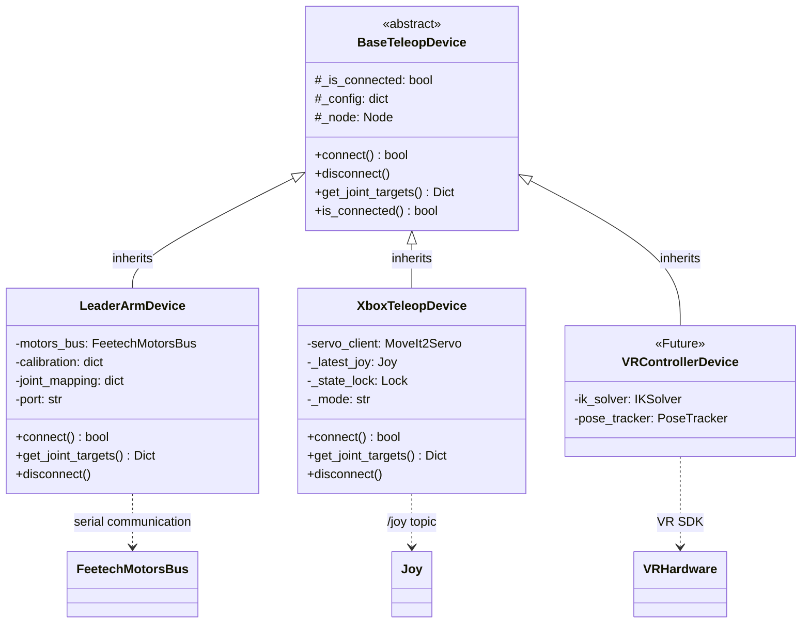
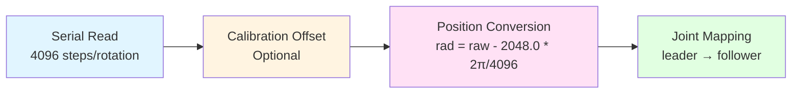
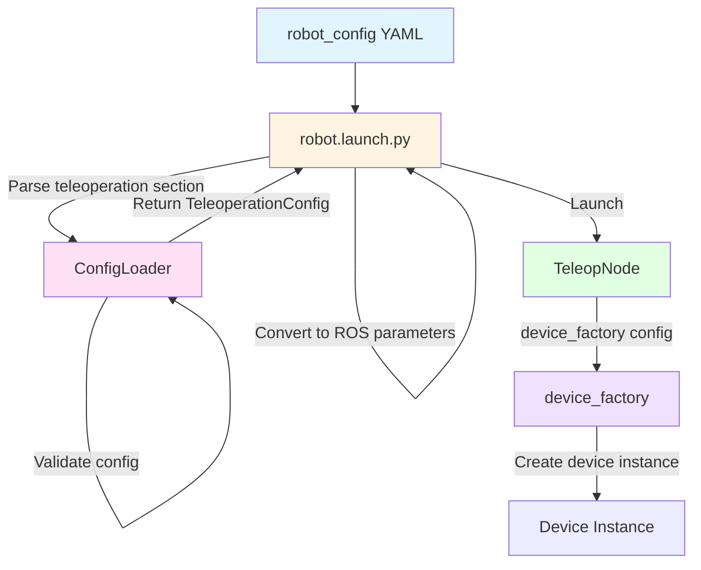

# robot_teleop

Minimal serial-to-controller bridge for zero-latency teleoperation.

## Overview

The `robot_teleop` package provides a unified teleoperation interface for IB-Robot, supporting multiple teleoperation devices (leader arms, gamepads, VR controllers) through a device abstraction layer.

**Key Features:**
- ✅ Zero-latency control (< 5ms end-to-end)
- ✅ Device abstraction with factory pattern
- ✅ Safety filtering with joint limits
- ✅ Configuration-driven via `robot_config`
- ✅ Automatic rosbag recording support
- ✅ Deep integration with `robot_config` launch system

## Architecture Design

### Overall Architecture

```mermaid
graph TB
    subgraph Input["Input Layer"]
        LA[Leader Arm<br/>Serial]
        XB[Xbox Controller<br/>/joy topic]
        VR[VR Controller<br/>Future]
    end
    
    subgraph Device["Device Abstraction Layer"]
        Base[BaseTeleopDevice<br/>Abstract Device Interface<br/><small>connect() / disconnect()<br/>get_joint_targets()</small>]
    end
    
    subgraph Control["Control Layer"]
        Node[TeleopNode<br/>Main Control Node<br/><small>control_loop @ 50Hz<br/>Thread-safe access<br/>Emergency stop handling</small>]
        Filter[SafetyFilter<br/>Safety Filter<br/><small>apply_limits()<br/>Joint limit enforcement</small>]
    end
    
    subgraph Output["Output Layer"]
        ROS[ROS 2 Controller Interface<br/><small>/arm_position_controller/commands<br/>/gripper_position_controller/commands<br/>/diagnostics</small>]
    end
    
    LA --> Base
    XB --> Base
    VR -.-> Base
    
    Base --> Node
    Node --> Filter
    Filter --> ROS
    
    style Input fill:#e1f5ff
    style Device fill:#fff4e1
    style Control fill:#ffe1f5
    style Output fill:#e1ffe1
```

### Class Inheritance and Dependencies

#### Class Inheritance Diagram



### Core Design Patterns

#### 1. Factory Pattern

**Location**: `device_factory.py`

**Purpose**: Dynamically create teleoperation device instances based on configuration, supporting extension of new device types.

```python
# Device registry
DEVICE_MAP = {
    "leader_arm": LeaderArmDevice,
    "xbox_controller": XboxTeleopDevice,
}

# Factory function
device = device_factory(config, node=node)

# Extend with new device
register_device("custom_device", CustomDevice)
```

**Advantages**:
- Decouples device creation from usage
- Supports runtime device switching
- Easy to extend with new device types

#### 2. Strategy Pattern

**Location**: `base_teleop.py` + device implementations

**Purpose**: Different devices implement different control strategies while providing a unified interface.

```python
# Abstract strategy interface
class BaseTeleopDevice(ABC):
    @abstractmethod
    def get_joint_targets(self) -> Dict[str, float]:
        pass

# Concrete strategy 1: LeaderArmDevice (direct mapping)
position_rad = (raw - 2048.0) * rad_per_step

# Concrete strategy 2: XboxTeleopDevice (incremental control)
new_pos = prev_cmd + delta
```

#### 3. Template Method Pattern

**Location**: `TeleopNode.control_loop_callback()`

**Purpose**: Defines the skeleton of the control loop, with specific steps implemented by devices.

```python
# Control loop template
def control_loop_callback(self):
    if self.estop_active:
        return
    
    # 1. Read device (polymorphic)
    joint_targets = self.device.get_joint_targets()
    
    # 2. Safety filtering
    safe_targets = self.safety_filter.apply_limits(joint_targets)
    
    # 3. Publish commands
    self.arm_cmd_pub.publish(arm_msg)
    self.gripper_cmd_pub.publish(gripper_msg)
```

### Core Components

#### 1. TeleopNode (Main Control Node)

**File**: `teleop_node.py`

**Responsibilities**:
- Manage 50 Hz control loop
- Device lifecycle management
- Safety filtering and command publishing
- Emergency stop handling
- Diagnostic information publishing

**Key Features**:
- ✅ Thread-safe (using `threading.Lock`)
- ✅ Low-latency design (< 5ms target)
- ✅ Exception tolerance
- ✅ Diagnostic monitoring

**Parameters**:
```yaml
control_frequency: 50.0        # Control frequency (Hz)
device_config: {...}           # Device configuration (JSON)
joint_limits: {...}            # Joint limits
arm_joint_names: ["1","2"...]  # Arm joint names
gripper_joint_names: ["6"]     # Gripper joint names
```

#### 2. BaseTeleopDevice (Abstract Device Interface)

**File**: `base_teleop.py`

**Responsibilities**: Defines the interface that all teleoperation devices must implement.

**Core Methods**:
```python
class BaseTeleopDevice(ABC):
    def connect(self) -> bool
        """Establish device connection"""
    
    def get_joint_targets(self) -> Dict[str, float]
        """Read joint target positions (50 Hz call)"""
    
    def disconnect(self)
        """Disconnect from device"""
```

**Design Principles**:
- **Interface Segregation**: Only expose necessary methods
- **Open-Closed Principle**: Open for extension, closed for modification
- **Dependency Inversion**: TeleopNode depends on abstraction, not concrete implementation

#### 3. SafetyFilter (Safety Filter)

**File**: `safety_filter.py`

**Responsibilities**: Enforce joint limits to prevent mechanical damage.

**Key Features**:
- ✅ Clip to safe range (using `numpy.clip`)
- ✅ Clipping statistics and logging
- ✅ Rate-limited warnings (avoid log flooding)

**Example**:
```python
# Input: {"1": 1.5, "2": 0.5}
# Limits: {"1": {"min": -1.0, "max": 1.0}}
# Output: {"1": 1.0, "2": 0.5}  # Joint "1" clipped
```

#### 4. DeviceFactory (Device Factory)

**File**: `device_factory.py`

**Responsibilities**: Dynamically create device instances based on configuration.

**Extension Mechanism**:
```python
# Built-in devices
DEVICE_MAP = {
    "leader_arm": LeaderArmDevice,
    "xbox_controller": XboxTeleopDevice,
}

# Runtime device registration
register_device("vr_controller", VRControllerDevice)
```

#### 5. ConfigLoader (Configuration Loader)

**File**: `config_loader.py`

**Responsibilities**: Load and validate teleoperation configurations.

**Data Classes**:
```python
@dataclass
class TeleopDeviceConfig:
    name: str
    type: str
    port: Optional[str]
    calib_file: Optional[str]
    joint_mapping: Dict[str, str]

@dataclass
class TeleoperationConfig:
    enabled: bool
    active_device: str
    devices: List[TeleopDeviceConfig]
    safety: TeleopSafetyConfig
```

### Device Implementations

#### 1. LeaderArmDevice (SO-101 Leader Arm)

**File**: `devices/leader_arm.py`

**Control Strategy**: Direct Joint Mapping

**Data Flow**:



**Key Features**:
- ✅ Zero latency (direct encoder reading)
- ✅ Calibration support (write to firmware)
- ✅ Compatible with Feetech motor protocol

**Configuration Example**:
```yaml
- name: "so101_leader"
  type: "leader_arm"
  port: "/dev/ttyACM1"
  calib_file: "~/.calibrate/so101_leader_calibrate.json"
  joint_mapping:
    "1": "1"  # Customizable mapping
    "2": "2"
```

#### 2. XboxTeleopDevice (Xbox Controller)

**File**: `devices/xbox_controller.py`

**Control Strategy**: Incremental Control + Cartesian Servo

**Supported Modes**:
1. **Joint Mode**: 
   - Controller axis → Joint increments
   - Integrator maintains internal state
   - Reverse-snap prevents jumping

2. **Cartesian Mode**:
   - Control via MoveIt2 Servo
   - Controller axis → Linear/angular velocity
   - Real-time trajectory planning

**Key Features**:
- ✅ Deadman button (Press A to enable)
- ✅ Reverse-snap algorithm (prevents jumping)
- ✅ Lead clamp (0.5 rad following window)
- ✅ Mode switching (Long press LB)

**State Management**:
```python
_current_joint_states = {}        # Physical robot state (from /joint_states)
_last_commanded_positions = {}    # Command state (integrator)
_current_gripper_pos = 0.0        # Gripper state
```

**Reverse-Snap Algorithm**:
```python
# Snap to actual position when direction reverses
lead = prev_cmd - actual
if (delta > 0 and lead < -0.01) or (delta < 0 and lead > 0.01):
    prev_cmd = actual  # Snap
```

### Performance Optimization

#### 1. Low-Latency Design

**Target**: End-to-end latency < 5ms

**Optimization Measures**:
```python
# 1. High-frequency control loop (50 Hz)
timer_period = 1.0 / 50.0  # 20ms

# 2. Minimize device read time
raw_positions = self.motors_bus.sync_read("Present_Position")

# 3. Fast safety filtering
safe_angle = np.clip(target_angle, min_limit, max_limit)  # < 0.5ms

# 4. Diagnostic rate limiting
if self.loop_count % 50 == 0:  # 1 Hz diagnostics
    publish_diagnostics()
```

#### 2. Memory Optimization

**Measures**:
- Reuse message objects
- Avoid unnecessary copies
- Use `dict` instead of temporary objects

#### 3. CPU Optimization

**Measures**:
- Use `numpy` vectorized operations
- Avoid redundant calculations
- Rate-limit log output

### Error Handling and Fault Tolerance

#### 1. Device Failure

```python
try:
    joint_targets = self.device.get_joint_targets()
except Exception as e:
    self.get_logger().error(f"Device read failed: {e}")
    return  # Skip this cycle, don't publish commands
```

#### 2. Connection Loss

```python
if not self.device.is_connected:
    return  # Wait for reconnection
```

#### 3. Emergency Stop

```python
def estop_callback(self, msg):
    self.estop_active = True
    # Stop publishing commands
```

### Extension Guide

#### Adding New Device Types

1. **Implement Device Class**:
```python
# devices/my_device.py
class MyDevice(BaseTeleopDevice):
    def connect(self) -> bool:
        # Initialize hardware
        
    def get_joint_targets(self) -> Dict[str, float]:
        # Return joint targets
        
    def disconnect(self):
        # Cleanup resources
```

2. **Register Device**:
```python
# device_factory.py
DEVICE_MAP["my_device"] = MyDevice
```

3. **Configure Usage**:
```yaml
devices:
  - name: "custom"
    type: "my_device"
    # Custom parameters
```

### Configuration Loading Process



## Installation

```bash
# Build
colcon build --packages-select robot_teleop --merge-install

# Source
source install/setup.bash
```

## Usage

### 1. Integrated Mode (Recommended)

Launch via `robot_config` with teleoperation support:

**Configuration** (in `src/robot_config/config/robots/so101_single_arm.yaml`):

```yaml
robot:
  control_modes:
    teleop:
      description: "Human teleoperation mode (direct control)"
      controllers:
        - joint_state_broadcaster
        - arm_position_controller
        - gripper_position_controller
      inference:
        enabled: false
        force_disable: true

  teleoperation:
    enabled: true
    active_device: "so101_leader"
    devices:
      - name: "so101_leader"
        type: "leader_arm"
        port: "/dev/ttyACM1"
        calib_file: "$(env HOME)/.calibrate/so101_leader_calibrate.json"
    safety:
      joint_limits:
        "1": {"min": -3.14, "max": 3.14}
        "2": {"min": -1.57, "max": 1.57}
        # ... more joints
```

**Launch:**

```bash
# Teleoperation mode
ros2 launch robot_config robot.launch.py \
    robot_config:=so101_single_arm \
    control_mode:=teleop \
    use_sim:=false

# With automatic recording
ros2 launch robot_config robot.launch.py \
    robot_config:=so101_single_arm \
    control_mode:=teleop \
    record:=true \
    use_sim:=false
```

### 2. Standalone Mode (Testing)

```bash
ros2 launch robot_teleop teleop_device.launch.py \
    port:=/dev/ttyACM1 \
    calib_file:=~/.calibrate/so101_leader_calibrate.json \
    control_frequency:=50.0
```

## Configuration Schema

### Teleoperation Section

```yaml
robot:
  teleoperation:
    enabled: bool                    # Enable teleoperation (default: true)
    active_device: string            # Name of the active device

    devices:
      - name: string                 # Unique device name
        type: string                 # Device type (leader_arm, xbox_controller, vr_device)
        ...device-specific params... # Additional parameters

    safety:
      joint_limits: dict             # Joint limits for safety filter
      estop_topic: string            # Emergency stop topic (default: /emergency_stop)
```

### Device Types

#### 1. leader_arm (SO-101 Leader Arm)

```yaml
- name: "so101_leader"
  type: "leader_arm"
  port: string                       # Serial port (e.g., /dev/ttyACM1)
  calib_file: string                 # Path to calibration JSON file (optional)
  joint_mapping: dict                # Leader → follower joint mapping (optional)
```

**Example:**
```yaml
devices:
  - name: "so101_leader"
    type: "leader_arm"
    port: "/dev/ttyACM1"
    calib_file: "~/.calibrate/so101_leader_calibrate.json"
    joint_mapping:
      "1": "1"  # Leader joint 1 → Follower joint 1
      "2": "2"
      "3": "3"
      "4": "4"
      "5": "5"
      "6": "6"
```

#### 2. xbox_controller (Xbox Controller)

```yaml
- name: "xbox"
  type: "xbox_controller"
  control_params:
    deadzone: 0.1                    # Joystick deadzone
    joint_velocity_gain: 1.5         # Joint velocity gain
    cartesian_linear_speed: 1.0      # Cartesian linear speed
    cartesian_angular_speed: 1.0     # Cartesian angular speed
    long_press_duration: 0.5         # Long press duration
    gripper_jog_speed: 8.0           # Gripper jog speed
  arm_joint_names: ["1","2","3","4","5"]
  gripper_joint_names: ["6"]
  joint_limits: {...}                # Joint limits
  mapping_config: "xbox_mapping"     # Button mapping config file
  default_mode: "joint"              # Default mode (joint/cartesian)
```

**Features:**
- ✅ Dual control modes: Joint mode + Cartesian mode
- ✅ Deadman button (Press A to enable control)
- ✅ Reverse-snap algorithm (prevents jumping)
- ✅ Mode switching (Long press LB)
- ✅ Preset positions (X: Home, Y: Preset)
- ✅ Gripper control (LT/RT)

**Button Mapping:**
- [A]: Enable control
- [B]: Disable control
- [LB] Long press: Switch mode (Joint ↔ Cartesian)
- [X]: Go to Home position
- [Y]: Go to Preset position
- [LT]: Close gripper
- [RT]: Open gripper

#### 3. vr_controller (Future)

```yaml
- name: "vr_controller"
  type: "vr_device"
  ... TBD ...
```

### Validation Rules

1. **Required fields:**
   - `teleoperation.enabled` must be true to enable teleop
   - `teleoperation.active_device` must be specified when enabled
   - Each device must have `name` and `type` fields

2. **Device-specific requirements:**
   - `leader_arm` devices require `port` field
   - `xbox_controller` requires `/joy` topic subscription
   - `vr_device` requires IK solver integration

3. **Safety requirements:**
   - `joint_limits` should cover all joints in `robot.joints.all`
   - Each joint limit needs `min` and `max` fields
   - `min` must be less than `max`

## Topics

**Published by TeleopNode:**
- `/arm_position_controller/commands` (Float64MultiArray) - 50 Hz
- `/gripper_position_controller/commands` (Float64MultiArray) - 50 Hz
- `/diagnostics` (DiagnosticArray) - 1 Hz

**Subscribed by TeleopNode:**
- `/emergency_stop` (Bool) - Emergency stop signal

## Safety

**Joint Limit Enforcement:**
- All commands pass through `SafetyFilter`
- Commands exceeding limits are clipped to nearest boundary
- Diagnostic warnings issued for clipped commands

**Emergency Stop:**
- Subscribes to `/emergency_stop` topic
- Stops publishing commands when E-stop is active
- Resumes when E-stop is cleared

## Performance Targets

- **Control loop frequency:** 50 Hz
- **End-to-end latency:** < 5ms (device read → topic publish)
- **Serial communication:** < 2ms per cycle
- **Safety filter:** < 0.5ms per cycle

## Troubleshooting

### Issue: "Controller not responding"

**Solution:** Verify controllers are spawned:
```bash
ros2 control list_controllers
# Should show: arm_position_controller[active]
```

### Issue: "Serial port permission denied"

**Solution:**
```bash
sudo chmod 666 /dev/ttyACM1
# Or add user to dialout group
sudo usermod -a -G dialout $USER
```

### Issue: "Teleop node not starting"

**Solution:** Check configuration:
1. Verify `teleoperation.enabled: true` in YAML
2. Verify `teleoperation.active_device` matches a device name
3. Verify device `type` is registered in `DEVICE_MAP`

## Documentation

- **Integration Guide:** [INTEGRATION_GUIDE.md](INTEGRATION_GUIDE.md)
- **Integration Status:** [INTEGRATION_COMPLETE.md](INTEGRATION_COMPLETE.md)
- **Implementation Status:** [IMPLEMENTATION_STATUS.md](IMPLEMENTATION_STATUS.md)

## Package Structure

```text
src/robot_teleop/
├── robot_teleop/                  # Core Python module
│   ├── __init__.py
│   ├── base_teleop.py            # Abstract device interface
│   ├── config_loader.py          # Configuration utilities
│   ├── device_factory.py         # Factory pattern
│   ├── safety_filter.py          # Safety layer
│   ├── teleop_node.py            # Main ROS 2 node
│   └── devices/
│       ├── __init__.py
│       ├── leader_arm.py         # SO-101 leader arm
│       └── xbox_controller.py    # Xbox controller
├── launch/
│   └── teleop_device.launch.py   # Standalone launch file
├── package.xml
├── setup.py
└── setup.cfg
```

## Related Packages

- **robot_config**: Configuration management and launch system
- **inference_service**: Model inference for autonomous control
- **action_dispatch**: Action execution and dispatching
- **so101_hardware**: SO-101 hardware interface

## License

Apache-2.0

## Maintainer

IB-Robot Team
