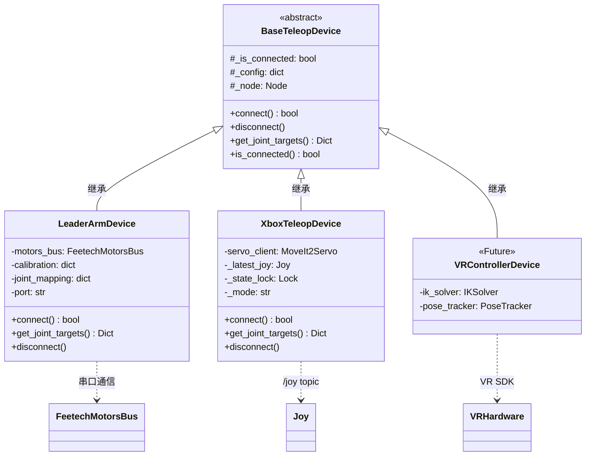
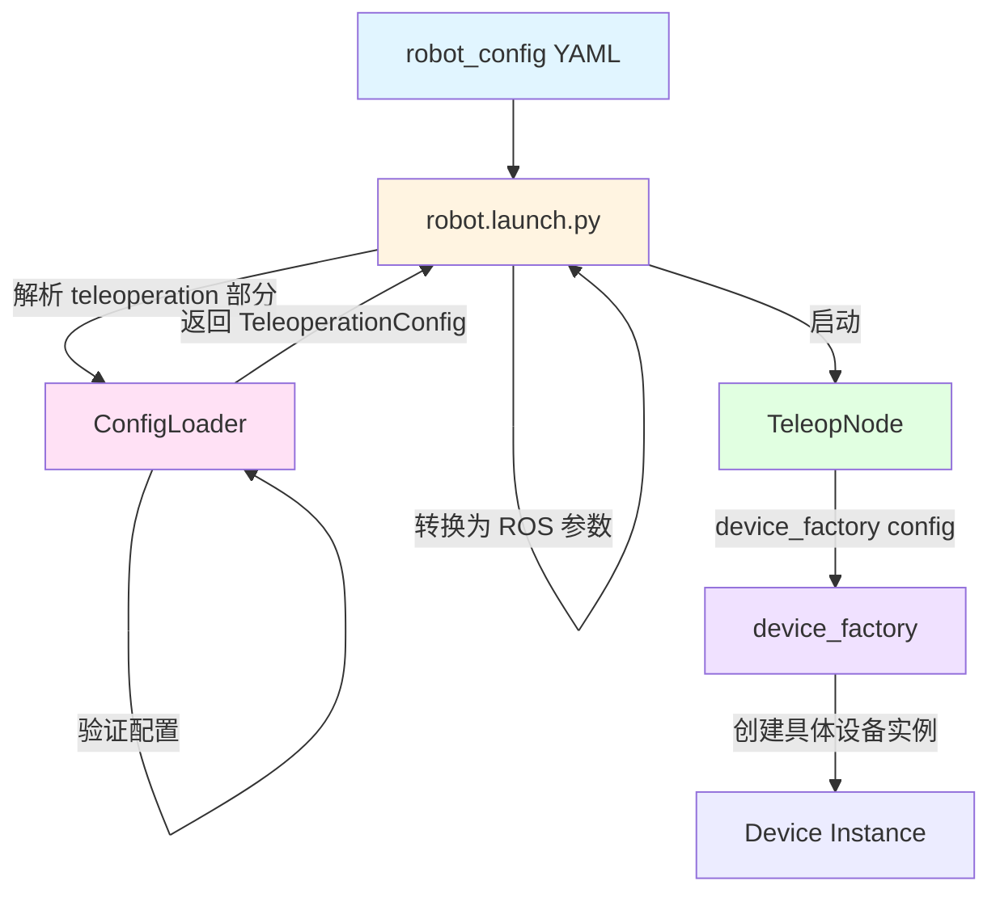

# robot_teleop

极简的串口到控制器桥接，用于零延迟遥操作。

## 概述 (Overview)

`robot_teleop` 包为 IB-Robot 提供了一个统一的遥操作接口，通过设备抽象层支持多种遥操作设备（示教臂、游戏手柄、VR 控制器）。

**核心特性:**
- ✅ 零延迟控制 (端到端 < 5ms)
- ✅ 基于工厂模式的设备抽象
- ✅ 具备关节限位的安全过滤
- ✅ 通过 `robot_config` 驱动的配置
- ✅ 支持自动的 rosbag 录制
- ✅ 与 `robot_config` 启动系统深度集成

## 架构设计 (Architecture Design)

### 整体架构图

```mermaid
graph TB
    subgraph Input["输入层 (Input Layer)"]
        LA[Leader Arm<br/>Serial]
        XB[Xbox 手柄<br/>/joy topic]
        VR[VR Controller<br/>Future]
    end
    
    subgraph Device["设备抽象层"]
        Base[BaseTeleopDevice<br/>抽象设备接口<br/><small>connect() / disconnect()<br/>get_joint_targets()</small>]
    end
    
    subgraph Control["控制层 (Control Layer)"]
        Node[TeleopNode<br/>主控制节点<br/><small>control_loop @ 50Hz<br/>线程安全访问<br/>紧急停止处理</small>]
        Filter[SafetyFilter<br/>安全过滤器<br/><small>apply_limits()<br/>关节限位强制</small>]
    end
    
    subgraph Output["输出层 (Output Layer)"]
        ROS[ROS 2 控制器接口<br/><small>/arm_position_controller/commands<br/>/gripper_position_controller/commands<br/>/diagnostics</small>]
    end
    
    LA --> Base
    XB --> Base
    VR -.-> Base
    
    Base --> Node
    Node --> Filter
    Filter --> ROS
    
    style Input fill:#e1f5ff
    style Device fill:#fff4e1
    style Control fill:#ffe1f5
    style Output fill:#e1ffe1
```

### 类继承关系与依赖

#### 类继承关系图



### 核心设计模式

#### 1. 工厂模式 (Factory Pattern)

**位置**: `device_factory.py`

**用途**: 根据配置动态创建遥操作设备实例，支持扩展新设备类型。

```python
# 设备注册表
DEVICE_MAP = {
    "leader_arm": LeaderArmDevice,
    "xbox_controller": XboxTeleopDevice,
}

# 工厂函数
device = device_factory(config, node=node)

# 扩展新设备
register_device("custom_device", CustomDevice)
```

**优势**:
- 解耦设备创建和使用
- 支持运行时设备切换
- 易于扩展新设备类型

#### 2. 策略模式 (Strategy Pattern)

**位置**: `base_teleop.py` + 各设备实现

**用途**: 不同设备实现不同的控制策略，但对外提供统一接口。

```python
# 抽象策略接口
class BaseTeleopDevice(ABC):
    @abstractmethod
    def get_joint_targets(self) -> Dict[str, float]:
        pass

# 具体策略 1: LeaderArmDevice (直接映射)
position_rad = (raw - 2048.0) * rad_per_step

# 具体策略 2: XboxTeleopDevice (增量控制)
new_pos = prev_cmd + delta
```

#### 3. 模板方法模式 (Template Method)

**位置**: `TeleopNode.control_loop_callback()`

**用途**: 定义控制循环的骨架，具体步骤由设备实现。

```python
# 控制循环模板
def control_loop_callback(self):
    if self.estop_active:
        return
    
    # 1. 读取设备 (多态)
    joint_targets = self.device.get_joint_targets()
    
    # 2. 安全过滤
    safe_targets = self.safety_filter.apply_limits(joint_targets)
    
    # 3. 发布命令
    self.arm_cmd_pub.publish(arm_msg)
    self.gripper_cmd_pub.publish(gripper_msg)
```

### 核心组件详解

#### 1. TeleopNode (主控制节点)

**文件**: `teleop_node.py`

**职责**:
- 管理 50 Hz 控制循环
- 设备生命周期管理
- 安全过滤和命令发布
- 紧急停止处理
- 诊断信息发布

**关键特性**:
- ✅ 线程安全 (使用 `threading.Lock`)
- ✅ 低延迟设计 (< 5ms 目标)
- ✅ 异常容错
- ✅ 诊断监控

**参数**:
```yaml
control_frequency: 50.0        # 控制频率 (Hz)
device_config: {...}           # 设备配置 (JSON)
joint_limits: {...}            # 关节限位
arm_joint_names: ["1","2"...]  # 手臂关节名称
gripper_joint_names: ["6"]     # 夹爪关节名称
```

#### 2. BaseTeleopDevice (抽象设备接口)

**文件**: `base_teleop.py`

**职责**: 定义所有遥操作设备必须实现的接口。

**核心方法**:
```python
class BaseTeleopDevice(ABC):
    def connect(self) -> bool
        """建立设备连接"""
    
    def get_joint_targets(self) -> Dict[str, float]
        """读取关节目标位置 (50 Hz 调用)"""
    
    def disconnect(self)
        """断开设备连接"""
```

**设计原则**:
- **接口隔离**: 只暴露必要的方法
- **开闭原则**: 对扩展开放，对修改关闭
- **依赖倒置**: TeleopNode 依赖抽象，不依赖具体实现

#### 3. SafetyFilter (安全过滤器)

**文件**: `safety_filter.py`

**职责**: 强制执行关节限位，防止机械损坏。

**关键特性**:
- ✅ 裁剪到安全范围 (使用 `numpy.clip`)
- ✅ 裁剪统计和日志
- ✅ 限流警告 (避免日志洪水)

**示例**:
```python
# 输入: {"1": 1.5, "2": 0.5}
# 限位: {"1": {"min": -1.0, "max": 1.0}}
# 输出: {"1": 1.0, "2": 0.5}  # Joint "1" 被裁剪
```

#### 4. DeviceFactory (设备工厂)

**文件**: `device_factory.py`

**职责**: 根据配置动态创建设备实例。

**扩展机制**:
```python
# 内置设备
DEVICE_MAP = {
    "leader_arm": LeaderArmDevice,
    "xbox_controller": XboxTeleopDevice,
}

# 运行时注册新设备
register_device("vr_controller", VRControllerDevice)
```

#### 5. ConfigLoader (配置加载器)

**文件**: `config_loader.py`

**职责**: 加载和验证遥操作配置。

**数据类**:
```python
@dataclass
class TeleopDeviceConfig:
    name: str
    type: str
    port: Optional[str]
    calib_file: Optional[str]
    joint_mapping: Dict[str, str]

@dataclass
class TeleoperationConfig:
    enabled: bool
    active_device: str
    devices: List[TeleopDeviceConfig]
    safety: TeleopSafetyConfig
```

### 设备实现详解

#### 1. LeaderArmDevice (SO-101 示教臂)

**文件**: `devices/leader_arm.py`

**控制策略**: 直接关节映射 (Direct Joint Mapping)

**数据流**:


**关键特性**:
- ✅ 零延迟 (直接读取编码器)
- ✅ 校准支持 (写入固件)
- ✅ 兼容 Feetech 电机协议

**配置示例**:
```yaml
- name: "so101_leader"
  type: "leader_arm"
  port: "/dev/ttyACM1"
  calib_file: "~/.calibrate/so101_leader_calibrate.json"
  joint_mapping:
    "1": "1"  # 可自定义映射
    "2": "2"
```

#### 2. XboxTeleopDevice (Xbox 手柄)

**文件**: `devices/xbox_controller.py`

**控制策略**: 增量控制 + 笛卡尔伺服

**支持模式**:
1. **关节模式 (Joint Mode)**: 
   - 手柄轴 → 关节增量
   - 积分器维护内部状态
   - 反向吸附 (Reverse-Snap) 防止跳跃

2. **笛卡尔模式 (Cartesian Mode)**:
   - 通过 MoveIt2 Servo 控制
   - 手柄轴 → 线性/角速度
   - 实时轨迹规划

**关键特性**:
- ✅ 死区按钮 (需按 A 启用)
- ✅ 反向吸附算法 (防止跳跃)
- ✅ 引导限制 (0.5 rad 跟随窗口)
- ✅ 模式切换 (长按 LB)

**状态管理**:
```python
_current_joint_states = {}        # 物理机器人状态 (来自 /joint_states)
_last_commanded_positions = {}    # 命令状态 (积分器)
_current_gripper_pos = 0.0        # 夹爪状态
```

**反向吸附算法**:
```python
# 当运动方向与引导方向相反时，吸附到实际位置
lead = prev_cmd - actual
if (delta > 0 and lead < -0.01) or (delta < 0 and lead > 0.01):
    prev_cmd = actual  # 吸附
```

### 性能优化

#### 1. 低延迟设计

**目标**: 端到端延迟 < 5ms

**优化措施**:
```python
# 1. 高频控制循环 (50 Hz)
timer_period = 1.0 / 50.0  # 20ms

# 2. 最小化设备读取时间
raw_positions = self.motors_bus.sync_read("Present_Position")

# 3. 快速安全过滤
safe_angle = np.clip(target_angle, min_limit, max_limit)  # < 0.5ms

# 4. 诊断限流
if self.loop_count % 50 == 0:  # 1 Hz 诊断
    publish_diagnostics()
```

### 扩展指南

#### 添加新设备类型

1. **实现设备类**:
```python
# devices/my_device.py
class MyDevice(BaseTeleopDevice):
    def connect(self) -> bool:
        # 初始化硬件
        
    def get_joint_targets(self) -> Dict[str, float]:
        # 返回关节目标
        
    def disconnect(self):
        # 清理资源
```

2. **注册设备**:
```python
# device_factory.py
DEVICE_MAP["my_device"] = MyDevice
```

3. **配置使用**:
```yaml
devices:
  - name: "custom"
    type: "my_device"
    # 自定义参数
```

### 配置加载流程



## 安装 (Installation)

```bash
# 编译
colcon build --packages-select robot_teleop --merge-install

# 刷新环境
source install/setup.bash
```

## 使用说明 (Usage)

### 1. 集成模式 (推荐)

通过 `robot_config` 启动并开启遥操作支持：

**配置** (在 `src/robot_config/config/robots/so101_single_arm.yaml` 中):

```yaml
robot:
  control_modes:
    teleop:
      description: "Human teleoperation mode (direct control)"
      controllers:
        - joint_state_broadcaster
        - arm_position_controller
        - gripper_position_controller
      inference:
        enabled: false
        force_disable: true

  teleoperation:
    enabled: true
    active_device: "so101_leader"
    devices:
      - name: "so101_leader"
        type: "leader_arm"
        port: "/dev/ttyACM1"
        calib_file: "$(env HOME)/.calibrate/so101_leader_calibrate.json"
    safety:
      joint_limits:
        "1": {"min": -3.14, "max": 3.14}
        "2": {"min": -1.57, "max": 1.57}
        # ... 更多关节
```

**启动:**

```bash
# 遥操作模式
ros2 launch robot_config robot.launch.py \
    robot_config:=so101_single_arm \
    control_mode:=teleop \
    use_sim:=false

# 附带自动录制
ros2 launch robot_config robot.launch.py \
    robot_config:=so101_single_arm \
    control_mode:=teleop \
    record:=true \
    use_sim:=false
```

### 2. 独立模式 (用于测试)

```bash
ros2 launch robot_teleop teleop_device.launch.py \
    port:=/dev/ttyACM1 \
    calib_file:=~/.calibrate/so101_leader_calibrate.json \
    control_frequency:=50.0
```

## 配置 Schema (Configuration Schema)

### 遥操作部分 (Teleoperation Section)

```yaml
robot:
  teleoperation:
    enabled: bool                    # 启用遥操作 (默认: true)
    active_device: string            # 激活的设备名称

    devices:
      - name: string                 # 唯一的设备名称
        type: string                 # 设备类型 (leader_arm, xbox_controller, vr_device)
        ...device-specific params... # 其他设备特定参数

    safety:
      joint_limits: dict             # 安全过滤器的关节限位
      estop_topic: string            # 紧急停止话题 (默认: /emergency_stop)
```

### 设备类型 (Device Types)

#### 1. leader_arm (SO-101 示教臂)

```yaml
- name: "so101_leader"
  type: "leader_arm"
  port: string                       # 串口 (例如: /dev/ttyACM1)
  calib_file: string                 # 校准 JSON 文件路径 (可选)
  joint_mapping: dict                # Leader → follower 关节映射 (可选)
```

**示例:**
```yaml
devices:
  - name: "so101_leader"
    type: "leader_arm"
    port: "/dev/ttyACM1"
    calib_file: "~/.calibrate/so101_leader_calibrate.json"
    joint_mapping:
      "1": "1"  # Leader joint 1 → Follower joint 1
      "2": "2"
      "3": "3"
      "4": "4"
      "5": "5"
      "6": "6"
```

#### 2. xbox_controller (Xbox 手柄)

```yaml
- name: "xbox"
  type: "xbox_controller"
  control_params:
    deadzone: 0.1                    # 摇杆死区
    joint_velocity_gain: 1.5         # 关节速度增益
    cartesian_linear_speed: 1.0      # 笛卡尔线速度
    cartesian_angular_speed: 1.0     # 笛卡尔角速度
    long_press_duration: 0.5         # 长按时长 (秒)
    gripper_jog_speed: 8.0           # 夹爪速度
  arm_joint_names: ["1","2","3","4","5"]
  gripper_joint_names: ["6"]
  joint_limits: {...}                # 关节限位
  mapping_config: "xbox_mapping"     # 按键映射配置文件
  default_mode: "joint"              # 默认模式 (joint/cartesian)
```

**特性:**
- ✅ 双控制模式: 关节模式 + 笛卡尔模式
- ✅ 死区按钮 (需按 A 启用控制)
- ✅ 反向吸附算法 (防止跳跃)
- ✅ 模式切换 (长按 LB)
- ✅ 预设位置 (X: Home, Y: Preset)
- ✅ 夹爪控制 (LT/RT)

**按键映射:**
- [A]: 启用控制
- [B]: 禁用控制
- [LB] 长按: 切换模式 (Joint ↔ Cartesian)
- [X]: 回到 Home 位置
- [Y]: 回到 Preset 位置
- [LT]: 关闭夹爪
- [RT]: 打开夹爪

#### 3. vr_controller (规划中)

```yaml
- name: "vr_controller"
  type: "vr_device"
  ... 待定 ...
```

### 验证规则 (Validation Rules)

1. **必填字段:**
   - `teleoperation.enabled` 必须为 true 才能启用遥操作
   - 启用时必须指定 `teleoperation.active_device`
   - 每个设备必须具有 `name` 和 `type` 字段

2. **设备特定要求:**
   - `leader_arm` 设备需要 `port` 字段
   - `xbox_controller` 需要订阅 `/joy` 话题
   - `vr_device` 需要集成 IK 求解器

3. **安全要求:**
   - `joint_limits` 应该覆盖 `robot.joints.all` 中的所有关节
   - 每个关节限位需要 `min` 和 `max` 字段
   - `min` 必须小于 `max`

## 话题 (Topics)

**由 TeleopNode 发布:**
- `/arm_position_controller/commands` (Float64MultiArray) - 50 Hz
- `/gripper_position_controller/commands` (Float64MultiArray) - 50 Hz
- `/diagnostics` (DiagnosticArray) - 1 Hz

**由 TeleopNode 订阅:**
- `/emergency_stop` (Bool) - 紧急停止信号

## 安全性 (Safety)

**关节限位强制执行:**
- 所有命令都要经过 `SafetyFilter`
- 超过限制的命令会被裁剪到最近的边界
- 对被裁剪的命令发出诊断警告

**紧急停止 (Emergency Stop):**
- 订阅 `/emergency_stop` 话题
- 当急停处于激活状态时停止发布命令
- 急停清除后恢复

## 性能目标 (Performance Targets)

- **控制循环频率:** 50 Hz
- **端到端延迟:** < 5ms (设备读取 → 话题发布)
- **串口通信:** < 2ms/周期
- **安全过滤:** < 0.5ms/周期

## 故障排除 (Troubleshooting)

### 问题: "Controller not responding" (控制器未响应)

**解决方案:** 验证控制器已生成 (spawned):
```bash
ros2 control list_controllers
# 应该显示: arm_position_controller[active]
```

### 问题: "Serial port permission denied" (串口权限被拒绝)

**解决方案:**
```bash
sudo chmod 666 /dev/ttyACM1
# 或者将用户添加到 dialout 用户组
sudo usermod -a -G dialout $USER
```

### 问题: "Teleop node not starting" (遥操作节点未启动)

**解决方案:** 检查配置:
1. 验证 YAML 中 `teleoperation.enabled: true`
2. 验证 `teleoperation.active_device` 是否与设备名称匹配
3. 验证设备 `type` 已在 `DEVICE_MAP` 中注册

## 包结构 (Package Structure)

```text
src/robot_teleop/
├── robot_teleop/                  # 核心 Python 模块
│   ├── __init__.py
│   ├── base_teleop.py            # 抽象设备接口
│   ├── config_loader.py          # 配置工具
│   ├── device_factory.py         # 工厂模式
│   ├── safety_filter.py          # 安全层
│   ├── teleop_node.py            # 主 ROS 2 节点
│   └── devices/
│       ├── __init__.py
│       ├── leader_arm.py         # SO-101 示教臂驱动
│       └── xbox_controller.py    # Xbox 手柄驱动
├── launch/
│   └── teleop_device.launch.py   # 独立启动文件
├── package.xml
├── setup.py
└── setup.cfg
```

## 相关软件包 (Related Packages)

- **robot_config**: 配置管理与启动系统
- **inference_service**: 自动控制的模型推理
- **action_dispatch**: 动作执行和分发
- **so101_hardware**: SO-101 硬件接口

## 许可证 (License)

Apache-2.0

## 维护者 (Maintainer)

IB-Robot Team
